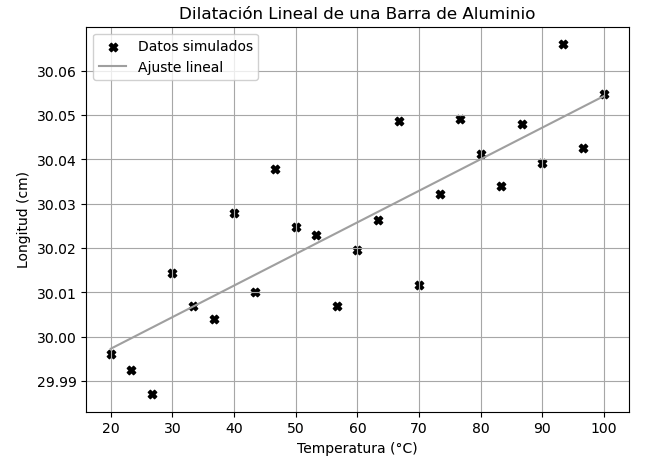
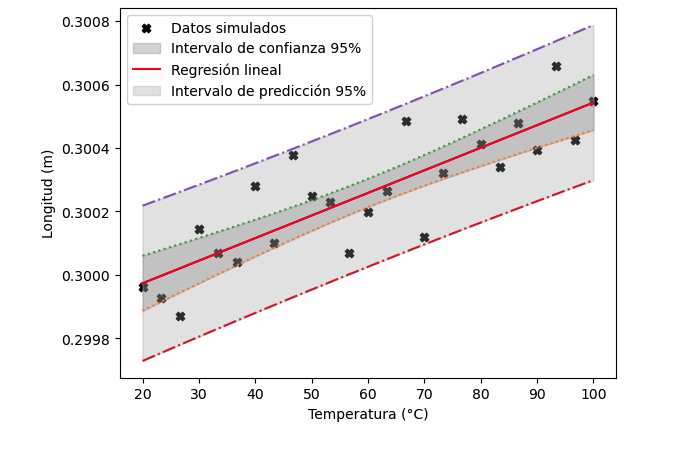

# Analisis Estadistico de Datos en el Laboratorio de Mecánica

Este repositorio contiene una colección de **notebooks de Jupyter** dedicados al análisis de datos experimentales obtenidos en diversas **prácticas de laboratorio de Mecánica Clásica**.
El objetivo es aplicar métodos cuantitativos y estadísticos para interpretar resultados experimentales, validar leyes físicas y desarrollar habilidades de análisis de datos científicos.

---
 

##  Contenido del Repositorio

Cada notebook aborda una práctica específica, incluyendo el tratamiento de datos, representación gráfica, ajuste de curvas y análisis de errores.

| Práctica                                      | Descripción                                                                                 |
| --------------------------------------------- | ------------------------------------------------------------------------------------------- |
| **Ley de Enfriamiento de Newton**             | Análisis del decaimiento de temperatura y ajuste exponencial.                               |
| **Ley de Stokes y Viscosidad**                | Estudio del movimiento de esferas en fluidos para determinar la viscosidad.                 |
| **Movimiento Armónico Simple (MAS)**          | Estudio experimental del movimiento oscilatorio sin amortiguamiento.                        |
| **Movimiento Armónico Amortiguado (MAA)**     | Análisis del decaimiento de la amplitud y determinación del coeficiente de amortiguamiento. |
| **Cálculo de Densidad**                       | Determinación de densidades mediante mediciones de masa y volumen.                          |
| **Propagación de Errores**                    | Cálculo y análisis de incertidumbres experimentales.                                        |
| **Análisis Estadístico**                      | Aplicación de medidas de tendencia central, dispersión y pruebas básicas de hipótesis.      |
| **Regresiones Lineales y Ajuste de Curvas**   | Uso de métodos de ajuste lineal y no lineal a datos experimentales.                         |
| **Barras de Error e Intervalos de Confianza** | Representación gráfica de la incertidumbre experimental.                                    |

---

## Requisitos

Para ejecutar los notebooks, asegúrate de tener instalado:

```bash
python >= 3.9
jupyterlab
numpy
pandas
matplotlib
scipy
seaborn
```
---
